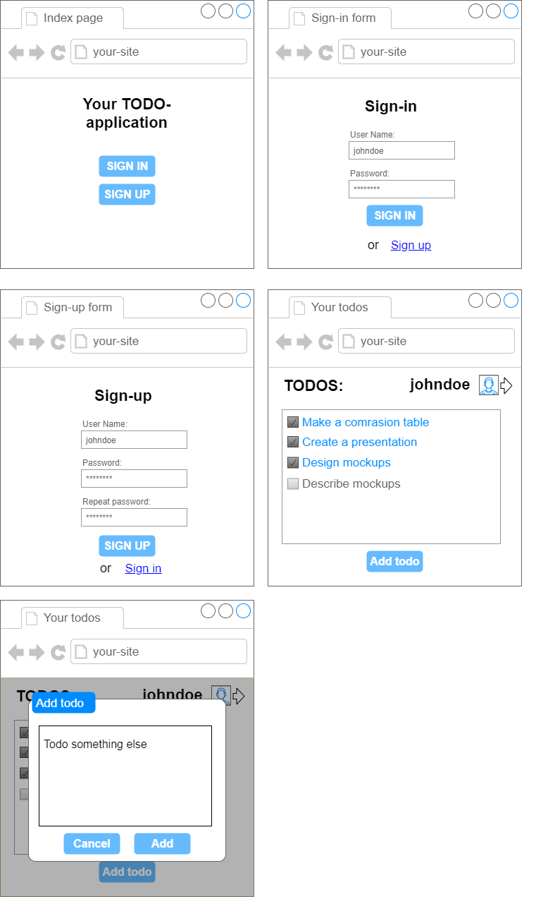

Task 3 Mockups
======

Design 5-7 screen mockups/wireframes of your application that shows its functionality.

You can use such online tools as https://app.diagrams.net/, https://www.figma.com/ and etc.

Give the name to each mockup, and describe its purpose. What elements do they have and why?

Example:
-------

Mockups for TODO-applcation

