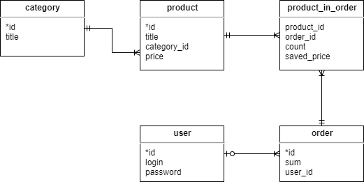

Task 4 ER-model
======

Create [ER-model](https://en.wikipedia.org/wiki/Entity%E2%80%93relationship_model) (use [Crow's foot notation](https://en.wikipedia.org/wiki/Entity%E2%80%93relationship_model#Crow's_foot_notation)) for your project

It must contain at least 5 entities. Specify their main attributes and describe the relationships between them

To draw diagram you can use such online tool as https://app.diagrams.net/ or similar

Example:
-------

ER-model for online shop

