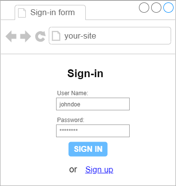
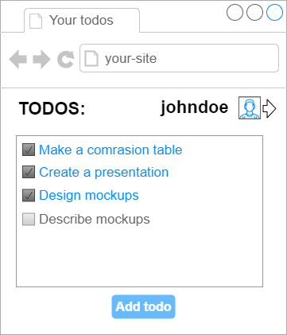

Task 6 API
======

For now you have views (mockups) and data structure (ER-model). You need to design [API](https://en.wikipedia.org/wiki/API)-functions that will connect your views and your data. 

Describe at least 10 API-functions:
- name of function
- description
- input parameters
- output data
- possible errors

Your API should contain functions to get and to update data of your system

**NOTE:** you DO NOT NEED to implement them
 
 Example of API:
 --------------
 
 For the following form:
 
 
 
 You need API-method:
 ```
 Method `signIn`
 ==============
 Gives user access to his private data and saved notes
 
 Input: 
 ------
 {
   username: string,
   password: string
 }
 Output:
 -------
 {
   userId: integer
   token: string
 }

 Errors:
 -------
 - Wrong username or password
 ```
 
 For the following form: 
 
 
 
 You need API-method:
 ```
 Method `getTodoList`
 ===================
 Returns list of notes created by user
 
 Input: 
 ------
 {
   token: string,   // token got from `signIn` method
 }
 Output:
 -------
 {
   list: [
     { text: string, finished: boolean },
     ...
   ]
 }
 
 Errors:
 -------
 - User is not signed in
 ```
